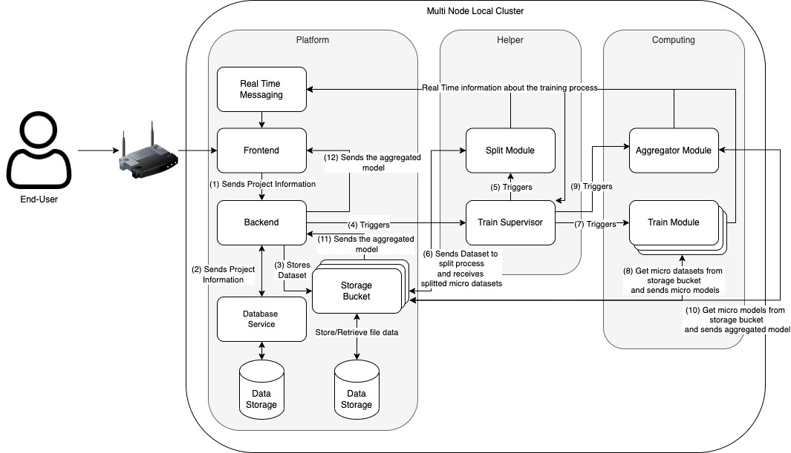
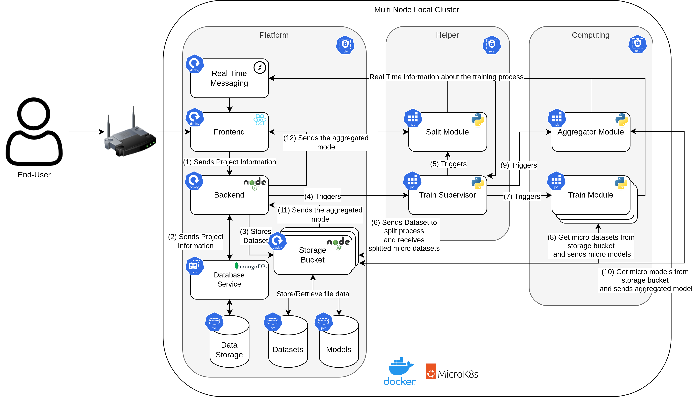

# 🚀 NeuralNetNexus

NeuralNetNexus is an innovative platform designed to streamline the process of training and aggregating machine learning models using a distributed approach. Leveraging the power of Kubernetes, it offers a scalable and efficient solution for handling large datasets and complex neural network architectures. Whether you're a machine learning enthusiast or a seasoned researcher, NeuralNetNexus provides a user-friendly interface and robust backend services to bring your AI projects to life. For a detailed insight into the project, check out the report available at [report](assets/ODDAI_Is_All_You_Need.pdf) in the repo.

## 📌 Table of Contents

For a visual demonstration of how the entire project functions, we have prepared a video walkthrough. You can watch the video and get a comprehensive understanding of the project's workflow, features, and capabilities.

[Watch the Demonstration Video](https://youtu.be/VaQolRGmXDo)

## 📌 Table of Contents

- [🚀 NeuralNetNexus](#-neuralnetnexus)
  - [📌 Table of Contents](#-table-of-contents)
  - [📌 Table of Contents](#-table-of-contents-1)
  - [🏗️ Architecture](#️-architecture)
  - [🛠️ Implementation](#️-implementation)
    - [🌐 Microk8s Kubernetes Cluster](#-microk8s-kubernetes-cluster)
      - [📦 Cluster Organization](#-cluster-organization)
      - [🚪 Ingresses](#-ingresses)
      - [📡 Services](#-services)
      - [🚀 Deployments, StatefulSets, and Jobs](#-deployments-statefulsets-and-jobs)
      - [💾 Persistence Volumes](#-persistence-volumes)
      - [🖥️ Runtime Clients and Automated Docker Image Process](#️-runtime-clients-and-automated-docker-image-process)
    - [🖥️ Platform](#️-platform)
    - [🧠 Distributed Learning](#-distributed-learning)
  - [📚 Additional Resources and Setup](#-additional-resources-and-setup)
    - [🛠️ MicroK8s Worker Setup](#️-microk8s-worker-setup)
    - [🐳 Dockerized Services](#-dockerized-services)

## 🏗️ Architecture

The architecture of **NeuralNetNexus** is designed as a roadmap for creating an effective platform for conducting machine learning operations. It lays the foundation for organized data processing, micro-model training, model aggregation, and provides continuous feedback to the end-user.

The architecture begins with an end-user interacting with the front-end interface to initiate a new AI project. This information is transmitted to the backend and stored in the database. Concurrently, the necessary dataset for the project is stored in a designated storage bucket, ready to be accessed by various system services and modules.

The backend activates the 'Train Supervisor' service, which directs the entire training process. All modules in the system communicate with a real-time messaging service, providing continuous feedback about the infrastructure and its operations.

The architecture's components are grouped into three main categories:

1. **Platform**: Consists of the front-end, back-end, database service, storage bucket, and real-time messaging service.
2. **Helpers**: Comprises the Train Supervisor and the Splitting Module.
3. **Computing Modules**: Includes the Training and Aggregator Modules.

For a detailed breakdown of each component, refer to the original report's architecture section.

## 🛠️ Implementation

The architecture is implemented using a cluster-based approach facilitated by Kubernetes (K8s) and MicroK8s. 

A Kubernetes cluster contains several modules serving a distributed AI solution. These include:

- **Config Maps** and **PVC**: Act as the system's memory, preserving configuration information and ensuring data persistence.
- **HPA**: Dynamically adjusts the system's capacity based on workload requirements.
- **Deployments**: Ensures constant pod uptime.
- **Ingresses**: Provides a communication link between the cluster and the outside world.
- **Jobs**: Manages specific tasks as the cluster's taskmasters.
- **Services**: Facilitates communication between cluster members.

The 'Platform' components correspond to our frontend, backend, database service, storage container, and real-time messaging service. The Train Supervisor and the Splitting Module are represented by the "Helpers," while the Training and Aggregator Modules are symbolized by the "Computing Modules."

### 🌐 Microk8s Kubernetes Cluster

MicroK8s was chosen for the Kubernetes cluster solution due to its lightweight and robust design. Several add-ons were enabled to enhance the system's capabilities, including DNS, ingress, storage, and the dashboard.

#### 📦 Cluster Organization

The Kubernetes implemented architecture uses roles and labels to identify different components of the system. Node affinity offers a more flexible solution by allowing a preference for specific nodes but not depending solely on them.

#### 🚪 Ingresses

Three unique ingress routes were set up:

1. **Frontend Ingress**: Handles traffic from the root URL, directing it to the frontend service.
2. **Backend Ingress**: Handles all API-related traffic with a size limit of 200Mb.
3. **Real-time Messaging Ingress**: Facilitates instantaneous bi-directional communication.

#### 📡 Services

Services provide a reliable means of communication between various pods. Only modules requiring external exposure or intra-cluster communication have dedicated services.

#### 🚀 Deployments, StatefulSets, and Jobs

Deployments and StatefulSets ensure the continuous operation and availability of pods. Jobs play a crucial part in the system's operation, dynamically initiating several processes.

#### 💾 Persistence Volumes

Three PVCs were utilized: one for datasets, one for models, and one for MongoDB. The approach used in the project involved centralizing the accesses through a single entity, the bucket service.

#### 🖥️ Runtime Clients and Automated Docker Image Process

To interact with the Kubernetes API, the system uses the Python and JavaScript Kubernetes client libraries. Docker Hub is used for storing and accessing the built container images.

### 🖥️ Platform

- **Frontend**: A web interface built with the React framework.
- **Backend**: Developed using Node.js in conjunction with the Express library.
- **Database service**: Employs a MongoDB database.
- **Real-time messaging**: Utilizes a Node.js WebSocket server with Socket.IO.
- **Storage bucket**: A dedicated service for storing datasets and models.
- **Horizontal Pod AutoScaling (HPA)**: Enables multiple users to simultaneously access the platform.

### 🧠 Distributed Learning

- **Training Supervisor**: Implemented in Python to initiate and ensure the right pods.
- **Split Module**: Handles the division of the imported dataset.
- **Training Module**: Designed for machine learning training using PyTorch.
- **Aggregator Model**: Combines the micro models generated from the Training modules using a mean-based approach.

For a detailed breakdown of each component, refer to the original report's implementation section.

## 📚 Additional Resources and Setup

### 🛠️ MicroK8s Worker Setup

For those interested in setting up the workers, we have provided a script named `microk8s.sh` in the repository. This script offers a step-by-step guide on how to properly set up the workers for the system.

### 🐳 Dockerized Services

Each service in our system comes with its own `Dockerfile`. This allows developers and users to run each service individually in a Docker container. To do so, navigate to the respective service's directory and build the Docker image using the provided Dockerfile. Once built, you can run the service in isolation, making it easier for debugging, development, and testing.
